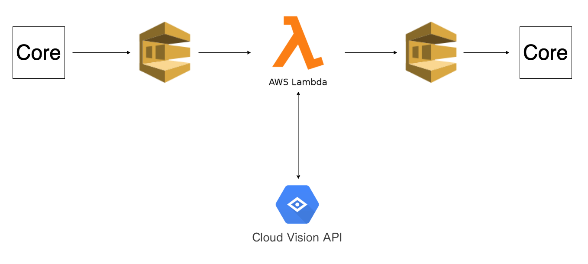

## The Problem:

While working at an online marketplace, one of the challenges encountered is the detection of frauds, which can be, usually, either:

1. A person trying to sell outside of the online platform, in order to avoid taxes/service fees;
2. A scam, where the object/product sold it's not what is being announced or doesn't even exist.

At [Uniplaces](https://www.uniplaces.com/), the landlord and the tenant have no communication until the booking is confirmed on both sides. This made a few landlords trying to bypass our restrictions and made tenants talk directly with them before the booking is done, avoiding our service fees. The most common way was to put the email/phone number on one of the images or even in the house description.

We also had multiple of the *type 2* cases, being most of them catch by our team but some of them actually resulting in a fraudulent case, where the tenant transferred the money to a scammer and got ghosted right after. 

## The Solution:

When a new property is added to our product, the landlord needs to upload multiple photos of the house. All those photos pass by our core system and then are stored on a cloud service.

Since we didn't want to add the logic of fraudulent offers to our core system, we decided to create an external service that would receive all the photos and then decide if the house published should be considered fraudulent or not. If so, that external service communicates again with our core system telling to unpublish the house offer.

Having in mind this new service wouldn't be in use all the time, we decided to go to a serverless approach, more specific, an AWS lambda. Also, since we didn't have the need of this service to be in real time (it could take several seconds to process the information), we also went to a queue approach, making all the process asynchronous.

In terms of optical character recognition (to extract the text from the image), the system is using the [Google Cloud Vision API](https://cloud.google.com/vision/docs/apis), which receives an image, configurable parameters (e.g., the type of algorithm and the type of document) and returns the text that is present on the image. By the time of development, we had more options on the table, but Google Cloud Vision API seemed to be best in terms of configurability, easy to use, and also in terms of pricing to our model.

In conclusion, for each photo that is updated, the reference is putted on a AWS SQS queue, which will be consumed by the lambda. Then, the lambda calls the Cloud Vision API with the image and a few parameters (so it can be analysed in a proper way to our use case) and receives the text present (if there's any) on the image. The lambda analyses this text and if there's a phone number or an email on it, publishes a new message to a different queue. Finally, our core system will read from this last queue and unpublish the offer correspondent to the fraudulent photo.

The solution can be illustrated as follows:

