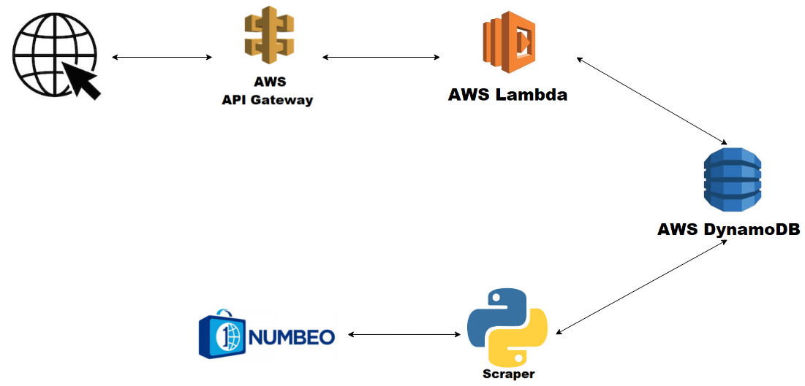

## A bit of context

One of the thing that you need to define, while selling stuff on a marketplace, is the price. It can be hard to came up with a price that is both reasonable for you and also competitive with the rest of the market, specially if it's your first rodeo.

At online house renting market, landlords must define the price of their houses/rooms/bedrooms. And it can be tricky not only due to a lot of market competition but also if you are new on this area. Most websites give you a recommendation, to help you figure a price out, based on the asset location and characteristic. This is what this service is all about!

## The solution

The service was made to be used as a REST API, where it could be called with specific parameters (let's only focus on the city for the sake of this example) and it would return a value.

As mentioned, I am using a crowd-sourced global database of reported consumer prices, more specifically [Numbeo](https://www.numbeo.com/common/api.jsp), to fulfil my database. This process is done by a Python scraper, which based on a list of countries and corresponding cities, calls the API with the correct parameters. The results of this process are then formatted to the [DynamoDB Data Format](https://docs.aws.amazon.com/amazondynamodb/latest/developerguide/AppendixSampleTables.html) and finally updated to the DynamoDB table.

The fact that we had a table filtered by city makes our service much faster, since it only has to query the DB table and return the value. But since we are using a AWS lambda to this solution, we need a way to create REST APIs in order to external services can call our own.

In order to "transform" the lambda into a REST API I am using the API gateway, taking also advantage of the [edge optimization](https://docs.aws.amazon.com/apigateway/latest/developerguide/api-gateway-api-endpoint-types.html) and the the cache mechanism that API gateway provides us.

It's worth to mention that, in order to help me define all the infrastructure but also to allow me to quickly deploy the service, I am using the serverless framework, where you only need to write a configuration file and deploy the service.

In conclusion, the service is called through an API endpoint that receives the city code, extra parameters (optional - e.g., number of bedrooms) and returns a price recommendation. To get this price value, the system only needs to apply some logic on the arguments passed and query the DB table. This DB table is periodically updated by a python scraper that fetches the information from a global database of reported consumer prices.

The architecture diagram can be illustrated as follows:

