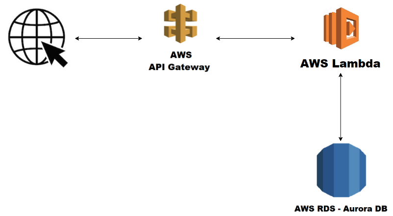

## Why Serverless?

In multiple past posts I talked about why the serverless approach was good to the use case in question, but I never really gave a more generic opinion on what type of use cases I think this approach is the right choice.

If you don't want to worry about scalability while having good flexibility, really good time to release, and also don't have a super high-demand use case (where maybe the cost will affect the equation), [serverless architectures](https://martinfowler.com/articles/serverless.html) are a really good solution for you. In case you want to build a traditional backend system, if you stick with AWS you are on a lucky. AWS not only provides [lambdas](https://aws.amazon.com/lambda/) where you code can run your code but also provides an integration with the [API gateway](https://aws.amazon.com/api-gateway/), which makes the development of RESTful APIs much easier.

If you want to use a database on your service, AWS also provides multiple serverless solutions. If you prefer a NoSQL approach, you have the [DynamoDB](https://aws.amazon.com/dynamodb/), which in terms of configurability it's probably the easier solution. On the other hand, if your use case is not good for NoSQL, AWS also provide the [Aurora DB](https://aws.amazon.com/rds/aurora/serverless/), through RDS. If you have doubts about which approach it's better for you, go check this [article](https://www.serverless.com/blog/choosing-a-database-with-serverless).

In addition to all of this, you also can take advantage of the [serverless framework](https://www.serverless.com/), which let's you write definitions, of the previous mention resources, through code (more specifically, in YAML format). This way, all you need to create and deploy your infrastructure is a file of code (or multiple, depending on your preference 😄).

## The architecture

After the previous explanations, the only thing that we are missing to choose to our promo codes system, is the database. I will not enter in business logic details, but for the use case I was aiming, a SQL approach was the best one. I had multiple filters, pagination, and sorts (since the service would serve a back office application), so the database chosen was the Aurora DB.

It's worth mentioning that, in a previous version, this service had it's own authentication system to validate, create and refresh JWT tokens. But, currently, only validates tokens, which should be generated by an external service.

In terms of API, as mentioned, the service allows to create, update, and validate promo codes. While not putting the full documentation here, both creation and update receive:

- owner;
- discount percentage;
- expiration date;
- description;

The API of validate is used when a user tries to use a promo code. This way we can validate if the promo code is still valid (due to the expiration date) and also if the user that is trying to use the promo code is the the owner of it. Here, to know the user that is trying to use the promo code, we use the JWT token passed on the request.

The architecture diagram can be illustrated as follows:

