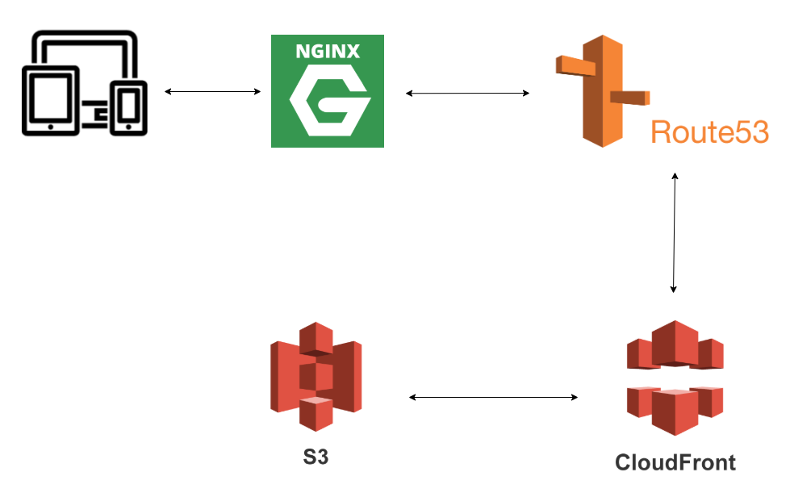

## The frontends of this life

Besides of bugs and new features/improvements in pre-existent projects, I never actually did anything major related with frontends. At my company most of my experience was related with [EmberJS](https://emberjs.com/), but at the time we were slowing migrating projects to React.

The project that I will talk on this post was not even in Ember, was built in our old SPA, written in vanilla JavaScript and PHP - and believe me, the project is surprisingly good, and if we didn't want to kill that old project there was no reason to change to a new technology 😄.

When the time came to choose a new technology, and since we were aiming to React, the decision was pretty easy. By the time, [GatsbyJS](https://www.gatsbyjs.com/) was (and probably still is) the best React-based framework to static content. By simple creating a new project and write few lines of code in the folder `pages` you have your first web page ready. Gatsby handles for you: routing, webpack configs, SEO (with [react-helmet](https://github.com/nfl/react-helmet)), and even lazy-load.

## The good

With Gatsby, to fetch the information, like images and texts, to the project you can use a CMS (which we later used [Prismic](https://prismic.io/)) but I started by just having markdown files and images on the project. Gatsby fetches this information, to render all the pages, using [GraphQL](https://www.gatsbyjs.com/docs/graphql/), which can be a tricky to use at first. Although this technique is specially useful in terms of images, where combined with the use of [gatsby-images](https://www.gatsbyjs.com/plugins/gatsby-image/) we have access to multiple sizes and resolutions of each image, which will be used to different screens and also helps a lot in terms of lazy-loading.

At this point you probably can guess why I went with this approach to boost SEO, but let me talk about the best part: Gatsby generates [server side rendering](https://www.gatsbyjs.com/docs/glossary/server-side-rendering/) out of the box 🤯 . This was the best improvement in comparison with the last project, where at the end of the first final version I had the score of 100 in [lighthouse](https://developers.google.com/web/tools/lighthouse).

## The not so good

But "life ain't roses", and so there were multiple problems faced in the development of the project. The first was regarding translations. By default Gatsby generates a route for each `.js` file you have in the folder `pages`, meaning you would need a folder for each language (no bueno), and to make things worst, libraries like i18n and intl didn't helped here. The final solution was a bit "hacky" and you can check it [here](https://medium.com/significa/i18n-with-gatsby-528607b4da81), but basically we need to tell gatsby that for each page it also needed to create the same page for all the other languages (not so simple in terms of code, as it seems).

Another problem I came across was the fact that I was using different sources for the html files (generated by gatsby) and for external files. To help the party I was using a nginx on top of the my original domain, meaning: while I had the rule to map "https://www.blog.com/page" to my original domain I couldn't (nor shouldn't) create rules to something like "https://www.blog.com/dummy.icon" or even more specific files generated by Gatsby during build time. Fortunately, at the same time I had this problem, Gatsby introduced the [asset-prefix](https://www.gatsbyjs.com/docs/asset-prefix/) feature, which allows the project to have a separated source to the CDN and to the core files.

## The architecture

As mentioned, the project is using AWS S3 + Cloudfront + Route53. Using S3 was a nice choice since it has really good compatibility with static websites. By just uploading the files generated by Gatsby you have a S3 url that displays your website, plus you can easily configure privacy aspects, like CORS or management of accesses (e.g., who can read or write). To make things easier, Gatsby as a community [plugin](https://www.gatsbyjs.com/plugins/gatsby-plugin-s3/) which by running a simple command deploys all the built files and also handles invalidation of caches, in case you have that problem.

On top of S3 I am also using Cloudfront, which not only distributes the content globally but also serves as a cache, making the requests to the website faster. After that I am using the Route53 to have access to a custom domain, which will the then be used on our ngnix.

The architecture diagram can be illustrated as follows:

